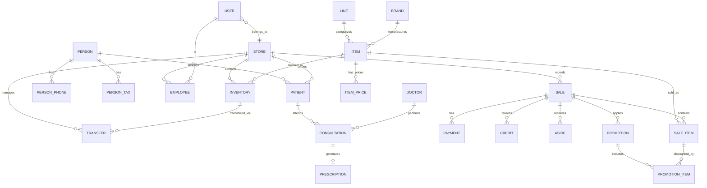

# Database Schema Documentation

Complete database schema reference for Opticas-Development system.

**Database Engine:** MySQL 8.0+  
**Charset:** utf8mb4  
**Collation:** utf8mb4_general_ci  

---

## Table of Contents

- [Entity Relationship Diagram](#entity-relationship-diagram)
- [Core Tables](#core-tables)
- [Sales Module](#sales-module)
- [Inventory Module](#inventory-module)
- [Patients Module](#patients-module)
- [Consultations Module](#consultations-module)
- [Financial Module](#financial-module)
- [Operations Module](#operations-module)
- [Marketing Module](#marketing-module)
- [Indexes and Performance](#indexes-and-performance)
- [Data Dictionary](#data-dictionary)

---

## Entity Relationship Diagram



---

## Core Tables

### users

User accounts for authentication and authorization.

| Column | Type | Constraints | Description |
|--------|------|-------------|-------------|
| id | INT | PK, AI | Unique identifier |
| username | VARCHAR(100) | UNIQUE | Username |
| email | VARCHAR(100) | UNIQUE | Email address |
| password | VARCHAR(255) | NOT NULL | Hashed password (Argon2id/BCRYPT) |
| active | TINYINT(1) | DEFAULT 1 | Account active status |
| created_at | DATETIME | | Creation timestamp |
| updated_at | DATETIME | | Last update timestamp |
| deleted_at | DATETIME | NULLABLE | Soft delete timestamp |

### persons

Personal information shared across patients, customers, and employees.

| Column | Type | Constraints | Description |
|--------|------|-------------|-------------|
| id | INT | PK, AI | Unique identifier |
| name | VARCHAR(100) | NOT NULL | First name |
| last_name | VARCHAR(100) | NOT NULL | Last name |
| dob | DATE | NULLABLE | Date of birth |
| email | VARCHAR(150) | NULLABLE | Email address |
| main_phone | VARCHAR(20) | NULLABLE | Primary phone number |
| street | VARCHAR(255) | NULLABLE | Street address |
| city | VARCHAR(100) | NULLABLE | City |
| state | VARCHAR(100) | NULLABLE | State/province |
| postal_code | VARCHAR(10) | NULLABLE | ZIP/Postal code |
| occupation_id | INT | FK | Occupation reference |
| created_at | DATETIME | | Creation timestamp |
| updated_at | DATETIME | | Last update timestamp |

### persons_phones

Multiple phone numbers for a person.

| Column | Type | Constraints | Description |
|--------|------|-------------|-------------|
| id | INT | PK, AI | Unique identifier |
| person_id | INT | FK to persons.id | Person reference |
| phone | VARCHAR(20) | NOT NULL | Phone number |
| type | VARCHAR(20) | NULLABLE | Type (mobile, home, work) |
| is_main | TINYINT(1) | DEFAULT 0 | Primary phone flag |

### persons_taxes

Tax information for persons (RFC in Mexico).

| Column | Type | Constraints | Description |
|--------|------|-------------|-------------|
| id | INT | PK, AI | Unique identifier |
| person_id | INT | FK to persons.id | Person reference |
| rfc | VARCHAR(13) | UNIQUE | Tax ID (RFC) |
| tax_regime | VARCHAR(100) | NULLABLE | Tax regime |
| tax_address | VARCHAR(255) | NULLABLE | Fiscal address |

### stores

Physical store locations.

| Column | Type | Constraints | Description |
|--------|------|-------------|-------------|
| id | INT | PK, AI | Unique identifier |
| name | VARCHAR(100) | NOT NULL | Store name |
| address | VARCHAR(255) | NULLABLE | Physical address |
| city | VARCHAR(100) | NULLABLE | City |
| state | VARCHAR(100) | NULLABLE | State |
| phone | VARCHAR(20) | NULLABLE | Store phone |
| is_active | TINYINT(1) | DEFAULT 1 | Active status |
| created_at | DATETIME | | Creation timestamp |

### employees

Employee records linked to users.

| Column | Type | Constraints | Description |
|--------|------|-------------|-------------|
| id | INT | PK, AI | Unique identifier |
| user_id | INT | FK to users.id | User account |
| person_id | INT | FK to persons.id | Personal information |
| store_id | INT | FK to stores.id | Assigned store |
| position | VARCHAR(50) | NULLABLE | Job title |
| hire_date | DATE | NULLABLE | Date hired |
| salary | DECIMAL(10,2) | NULLABLE | Monthly salary |
| is_active | TINYINT(1) | DEFAULT 1 | Active status |
| created_at | DATETIME | | Creation timestamp |

---

## Sales Module

### sales

Main sales transaction records.

| Column | Type | Constraints | Description |
|--------|------|-------------|-------------|
| id | INT | PK, AI | Unique identifier |
| uuid | CHAR(36) | UNIQUE | UUID for tracking |
| type | ENUM | NOT NULL | Sale type (cash, credit, aside) |
| subtotal | DECIMAL(12,2) | DEFAULT 0.00 | Subtotal before discounts |
| discount_total | DECIMAL(12,2) | DEFAULT 0.00 | Total discount amount |
| tax_total | DECIMAL(12,2) | DEFAULT 0.00 | Total tax amount |
| total | DECIMAL(12,2) | NOT NULL | Final total |
| status | VARCHAR(20) | DEFAULT 'completed' | Sale status |
| notes | TEXT | NULLABLE | Notes or comments |
| consultation_id | INT | FK to consultations.id | Related consultation |
| store_id | INT | FK to stores.id | Store where sale occurred |
| user_id | INT | FK to users.id | Salesperson |
| customer_id | INT | FK to patients.id | Customer |
| created_at | DATETIME | | Sale timestamp |
| updated_at | DATETIME | | Last update timestamp |

**Sale Types:**
- `cash`: Immediate payment, inventory decremented
- `credit`: Credit sale, creates credit record
- `aside`: Reserved/partial payment

### sale_items

Individual items within a sale.

| Column | Type | Constraints | Description |
|--------|------|-------------|-------------|
| id | INT | PK, AI | Unique identifier |
| sale_id | INT | FK to sales.id | Parent sale |
| item_id | INT | FK to items.id | Product/item |
| inventory_id | INT | FK to inventory.id | Inventory record used |
| qty | INT | NOT NULL | Quantity |
| unit_price | DECIMAL(10,2) | NOT NULL | Unit price |
| subtotal | DECIMAL(12,2) | DEFAULT 0.00 | Subtotal for this item |
| discount | DECIMAL(10,2) | DEFAULT 0.00 | Discount amount |
| total | DECIMAL(12,2) | DEFAULT 0.00 | Total for this item |
| lens_side | ENUM | NULLABLE | Lens side (left, right, pair) |
| created_at | DATETIME | | Creation timestamp |

### payments

Payment records for sales.

| Column | Type | Constraints | Description |
|--------|------|-------------|-------------|
| id | INT | PK, AI | Unique identifier |
| sale_id | INT | FK to sales.id | Parent sale |
| type | ENUM | NOT NULL | Payment type |
| amount | DECIMAL(12,2) | NOT NULL | Payment amount |
| received | DECIMAL(12,2) | NULLABLE | Amount received (for cash) |
| cashback | DECIMAL(12,2) | DEFAULT 0.00 | Change to return |
| card_id | INT | FK to payment_cards.id | Card used (if card payment) |
| reference | VARCHAR(100) | NULLABLE | Transaction reference |
| created_at | DATETIME | | Payment timestamp |

**Payment Types:**
- `cash`: Cash payment
- `card`: Credit/debit card
- `transfer`: Bank transfer
- `spei`: SPEI transfer (Mexico)

### credits

Credit sale records.

| Column | Type | Constraints | Description |
|--------|------|-------------|-------------|
| id | INT | PK, AI | Unique identifier |
| sale_id | INT | FK to sales.id | Parent sale |
| patient_id | INT | FK to patients.id | Customer |
| amount | DECIMAL(12,2) | NOT NULL | Credit amount |
| balance | DECIMAL(12,2) | NOT NULL | Remaining balance |
| due_date | DATE | NOT NULL | Due date |
| status | VARCHAR(20) | DEFAULT 'pending' | Credit status |
| created_at | DATETIME | | Creation timestamp |

**Credit Status:**
- `pending`: Pending payment
- `partial`: Partially paid
- `paid`: Fully paid
- `overdue`: Past due

### asides

Reserved/partial payment records.

| Column | Type | Constraints | Description |
|--------|------|-------------|-------------|
| id | INT | PK, AI | Unique identifier |
| sale_id | INT | FK to sales.id | Parent sale |
| patient_id | INT | FK to patients.id | Customer |
| amount | DECIMAL(12,2) | NOT NULL | Aside amount |
| balance | DECIMAL(12,2) | NOT NULL | Remaining balance |
| due_date | DATE | NULLABLE | Pickup due date |
| status | VARCHAR(20) | DEFAULT 'active' | Aside status |
| created_at | DATETIME | | Creation timestamp |

**Aside Status:**
- `active`: Reserved, awaiting pickup
- `completed`: Picked up
- `cancelled`: Cancelled

### invoices

Invoice records for sales.

| Column | Type | Constraints | Description |
|--------|------|-------------|-------------|
| id | INT | PK, AI | Unique identifier |
| sale_id | INT | FK to sales.id | Related sale |
| invoice_number | VARCHAR(50) | UNIQUE | Invoice number |
| subtotal | DECIMAL(12,2) | NOT NULL | Subtotal |
| tax_total | DECIMAL(12,2) | NOT NULL | Tax total |
| total | DECIMAL(12,2) | NOT NULL | Invoice total |
| pdf_path | VARCHAR(255) | NULLABLE | PDF file path |
| created_at | DATETIME | | Creation timestamp |

---

## Inventory Module

### items

Product catalog.

| Column | Type | Constraints | Description |
|--------|------|-------------|-------------|
| id | INT | PK, AI | Unique identifier |
| name | VARCHAR(150) | NOT NULL | Product name |
| sku | VARCHAR(50) | NULLABLE | Stock keeping unit |
| description | TEXT | NULLABLE | Product description |
| line_id | INT | FK to lines.id | Product line/category |
| brand_id | INT | FK to brands.id | Brand |
| is_stockable | TINYINT(1) | DEFAULT 1 | Can be stocked flag |
| created_at | DATETIME | | Creation timestamp |
| updated_at | DATETIME | | Last update timestamp |

### item_prices

Price history for items.

| Column | Type | Constraints | Description |
|--------|------|-------------|-------------|
| id | INT | PK, AI | Unique identifier |
| item_id | INT | FK to items.id | Product |
| price | DECIMAL(10,2) | NOT NULL | Sale price |
| start_date | DATE | NOT NULL | Price effective from |
| end_date | DATE | NULLABLE | Price effective to |
| created_at | DATETIME | | Creation timestamp |

### inventories

Stock records per store.

| Column | Type | Constraints | Description |
|--------|------|-------------|-------------|
| id | INT | PK, AI | Unique identifier |
| code | VARCHAR(50) | UNIQUE | Inventory code |
| store_id | INT | FK to stores.id | Store |
| item_id | INT | FK to items.id | Product |
| stock | INT | NOT NULL | Quantity |
| cost_price | DECIMAL(10,2) | NOT NULL | Cost price |
| enter_at | DATE | NOT NULL | Entry date |
| created_at | DATETIME | | Creation timestamp |

### transfers

Stock transfers between stores.

| Column | Type | Constraints | Description |
|--------|------|-------------|-------------|
| id | INT | PK, AI | Unique identifier |
| code | VARCHAR(50) | UNIQUE | Transfer code |
| from_store_id | INT | FK to stores.id | Origin store |
| to_store_id | INT | FK to stores.id | Destination store |
| item_id | INT | FK to items.id | Product |
| qty | INT | NOT NULL | Quantity |
| status | VARCHAR(20) | DEFAULT 'pending' | Transfer status |
| created_at | DATETIME | | Creation timestamp |

**Transfer Status:**
- `pending`: Awaiting processing
- `in_transit`: En route
- `completed`: Received at destination
- `cancelled`: Cancelled

### purchases

Purchase records from suppliers.

| Column | Type | Constraints | Description |
|--------|------|-------------|-------------|
| id | INT | PK, AI | Unique identifier |
| supplier_id | INT | FK to suppliers.id | Supplier |
| item_id | INT | FK to items.id | Product |
| qty | INT | NOT NULL | Quantity |
| cost_price | DECIMAL(10,2) | NOT NULL | Unit cost |
| total | DECIMAL(12,2) | NOT NULL | Total cost |
| purchase_date | DATE | NOT NULL | Purchase date |
| created_at | DATETIME | | Creation timestamp |

---

## Patients Module

### patients

Patient/customer records.

| Column | Type | Constraints | Description |
|--------|------|-------------|-------------|
| id | INT | PK, AI | Unique identifier |
| person_id | INT | FK to persons.id | Personal information |
| store_id | INT | FK to stores.id | Primary store |
| card_id | VARCHAR(20) | NULLABLE | Customer card number |
| company | VARCHAR(100) | NULLABLE | Company/employer |
| user_id | INT | FK to users.id | Created by |
| created_at | DATETIME | | Creation timestamp |
| updated_at | DATETIME | | Last update timestamp |

### orders

Special orders for patients.

| Column | Type | Constraints | Description |
|--------|------|-------------|-------------|
| id | INT | PK, AI | Unique identifier |
| patient_id | INT | FK to patients.id | Patient |
| status | VARCHAR(20) | DEFAULT 'pending' | Order status |
| notes | TEXT | NULLABLE | Order notes |
| created_at | DATETIME | | Creation timestamp |

**Order Status:**
- `pending`: Awaiting processing
- `processing`: Being prepared
- `ready`: Ready for pickup
- `completed`: Delivered
- `cancelled`: Cancelled

---

## Consultations Module

### consultations

Medical consultation records.

| Column | Type | Constraints | Description |
|--------|------|-------------|-------------|
| id | INT | PK, AI | Unique identifier |
| patient_id | INT | FK to patients.id | Patient |
| doctor_id | INT | FK to doctors.id | Doctor |
| consultation_date | DATETIME | NOT NULL | Date/time |
| notes | TEXT | NULLABLE | Consultation notes |
| created_at | DATETIME | | Creation timestamp |

### consultations_general

General medical background.

| Column | Type | Constraints | Description |
|--------|------|-------------|-------------|
| id | INT | PK, AI | Unique identifier |
| consultation_id | INT | FK to consultations.id | Parent consultation |
| chief_complaint | TEXT | NULLABLE | Chief complaint |
| medical_history | TEXT | NULLABLE | Medical history |
| family_history | TEXT | NULLABLE | Family history |
| allergies | TEXT | NULLABLE | Allergies |

### consultations_visual_evaluation

Visual examination results.

| Column | Type | Constraints | Description |
|--------|------|-------------|-------------|
| id | INT | PK, AI | Unique identifier |
| consultation_id | INT | FK to consultations.id | Parent consultation |
| right_eye_sph | VARCHAR(10) | NULLABLE | Right eye sphere |
| right_eye_cyl | VARCHAR(10) | NULLABLE | Right eye cylinder |
| right_eye_axis | VARCHAR(10) | NULLABLE | Right eye axis |
| left_eye_sph | VARCHAR(10) | NULLABLE | Left eye sphere |
| left_eye_cyl | VARCHAR(10) | NULLABLE | Left eye cylinder |
| left_eye_axis | VARCHAR(10) | NULLABLE | Left eye axis |

### prescriptions

Prescription records.

| Column | Type | Constraints | Description |
|--------|------|-------------|-------------|
| id | INT | PK, AI | Unique identifier |
| consultation_id | INT | FK to consultations.id | Parent consultation |
| prescription_date | DATE | NOT NULL | Prescription date |
| notes | TEXT | NULLABLE | Prescription notes |
| created_at | DATETIME | | Creation timestamp |

### prescription_details

Detailed prescription per eye.

| Column | Type | Constraints | Description |
|--------|------|-------------|-------------|
| id | INT | PK, AI | Unique identifier |
| prescription_id | INT | FK to prescriptions.id | Parent prescription |
| eye | ENUM | NOT NULL | Eye (right, left) |
| sph | VARCHAR(10) | NULLABLE | Sphere power |
| cyl | VARCHAR(10) | NULLABLE | Cylinder power |
| axis | VARCHAR(10) | NULLABLE | Axis |
| add | VARCHAR(10) | NULLABLE | Add power |
| pd | VARCHAR(10) | NULLABLE | Pupillary distance |

### doctors

Optometrists/doctors.

| Column | Type | Constraints | Description |
|--------|------|-------------|-------------|
| id | INT | PK, AI | Unique identifier |
| person_id | INT | FK to persons.id | Personal information |
| license_number | VARCHAR(50) | NULLABLE | Professional license |
| specialty | VARCHAR(100) | NULLABLE | Specialty |
| is_active | TINYINT(1) | DEFAULT 1 | Active status |
| created_at | DATETIME | | Creation timestamp |

---

## Financial Module

### expenses

Expense records.

| Column | Type | Constraints | Description |
|--------|------|-------------|-------------|
| id | INT | PK, AI | Unique identifier |
| category_id | INT | FK to expenses_categories.id | Category |
| store_id | INT | FK to stores.id | Store |
| amount | DECIMAL(12,2) | NOT NULL | Amount |
| description | VARCHAR(255) | NULLABLE | Description |
| expense_date | DATE | NOT NULL | Expense date |
| created_at | DATETIME | | Creation timestamp |

### expenses_categories

Expense categories.

| Column | Type | Constraints | Description |
|--------|------|-------------|-------------|
| id | INT | PK, AI | Unique identifier |
| name | VARCHAR(100) | NOT NULL | Category name |
| description | VARCHAR(255) | NULLABLE | Description |
| is_active | TINYINT(1) | DEFAULT 1 | Active status |

### incomes

Income records.

| Column | Type | Constraints | Description |
|--------|------|-------------|-------------|
| id | INT | PK, AI | Unique identifier |
| store_id | INT | FK to stores.id | Store |
| amount | DECIMAL(12,2) | NOT NULL | Amount |
| description | VARCHAR(255) | NULLABLE | Description |
| income_date | DATE | NOT NULL | Income date |
| created_at | DATETIME | | Creation timestamp |

### commissions

Sales commissions.

| Column | Type | Constraints | Description |
|--------|------|-------------|-------------|
| id | INT | PK, AI | Unique identifier |
| sale_id | INT | FK to sales.id | Sale |
| user_id | INT | FK to users.id | Salesperson |
| amount | DECIMAL(10,2) | NOT NULL | Commission amount |
| percentage | DECIMAL(5,2) | NULLABLE | Percentage |
| created_at | DATETIME | | Creation timestamp |

### bank_accounts

Bank account records.

| Column | Type | Constraints | Description |
|--------|------|-------------|-------------|
| id | INT | PK, AI | Unique identifier |
| bank_name | VARCHAR(100) | NOT NULL | Bank name |
| account_number | VARCHAR(50) | UNIQUE | Account number |
| account_type | VARCHAR(20) | NULLABLE | Account type |
| store_id | INT | FK to stores.id | Store |
| is_active | TINYINT(1) | DEFAULT 1 | Active status |
| created_at | DATETIME | | Creation timestamp |

---

## Operations Module

### lines

Product lines/categories.

| Column | Type | Constraints | Description |
|--------|------|-------------|-------------|
| id | INT | PK, AI | Unique identifier |
| name | VARCHAR(100) | NOT NULL | Line name |
| description | VARCHAR(255) | NULLABLE | Description |
| is_active | TINYINT(1) | DEFAULT 1 | Active status |

**Common Lines:**
- 13: Lentes (Lenses)
- 14: Armazones (Frames)
- 15: Contactos (Contact Lenses)
- 16: Micas (Lens coatings)

### brands

Product brands.

| Column | Type | Constraints | Description |
|--------|------|-------------|-------------|
| id | INT | PK, AI | Unique identifier |
| name | VARCHAR(100) | NOT NULL | Brand name |
| logo | VARCHAR(255) | NULLABLE | Logo image path |
| is_active | TINYINT(1) | DEFAULT 1 | Active status |
| created_at | DATETIME | | Creation timestamp |

### suppliers

Suppliers/vendors.

| Column | Type | Constraints | Description |
|--------|------|-------------|-------------|
| id | INT | PK, AI | Unique identifier |
| name | VARCHAR(100) | NOT NULL | Supplier name |
| contact_person | VARCHAR(100) | NULLABLE | Contact person |
| phone | VARCHAR(20) | NULLABLE | Phone |
| email | VARCHAR(150) | NULLABLE | Email |
| address | VARCHAR(255) | NULLABLE | Address |
| is_active | TINYINT(1) | DEFAULT 1 | Active status |
| created_at | DATETIME | | Creation timestamp |

### labs

Laboratories for lens processing.

| Column | Type | Constraints | Description |
|--------|------|-------------|-------------|
| id | INT | PK, AI | Unique identifier |
| name | VARCHAR(100) | NOT NULL | Lab name |
| contact_person | VARCHAR(100) | NULLABLE | Contact person |
| phone | VARCHAR(20) | NULLABLE | Phone |
| email | VARCHAR(150) | NULLABLE | Email |
| address | VARCHAR(255) | NULLABLE | Address |
| is_active | TINYINT(1) | DEFAULT 1 | Active status |
| created_at | DATETIME | | Creation timestamp |

### companies

Companies/organizations.

| Column | Type | Constraints | Description |
|--------|------|-------------|-------------|
| id | INT | PK, AI | Unique identifier |
| name | VARCHAR(100) | NOT NULL | Company name |
| rfc | VARCHAR(13) | NULLABLE | Tax ID |
| address | VARCHAR(255) | NULLABLE | Address |
| phone | VARCHAR(20) | NULLABLE | Phone |
| email | VARCHAR(150) | NULLABLE | Email |
| is_active | TINYINT(1) | DEFAULT 1 | Active status |
| created_at | DATETIME | | Creation timestamp |

### contracts

Company contracts.

| Column | Type | Constraints | Description |
|--------|------|-------------|-------------|
| id | INT | PK, AI | Unique identifier |
| company_id | INT | FK to companies.id | Company |
| patient_id | INT | FK to patients.id | Patient |
| contract_number | VARCHAR(50) | UNIQUE | Contract number |
| start_date | DATE | NOT NULL | Start date |
| end_date | DATE | NULLABLE | End date |
| discount_percentage | DECIMAL(5,2) | NULLABLE | Discount % |
| is_active | TINYINT(1) | DEFAULT 1 | Active status |
| created_at | DATETIME | | Creation timestamp |

---

## Marketing Module

### promotions

Promotional campaigns.

| Column | Type | Constraints | Description |
|--------|------|-------------|-------------|
| id | INT | PK, AI | Unique identifier |
| code | VARCHAR(50) | UNIQUE | Promo code |
| name | VARCHAR(150) | NOT NULL | Promotion name |
| description | TEXT | NULLABLE | Description |
| type | ENUM | NOT NULL | Discount type |
| value | DECIMAL(10,2) | NOT NULL | Discount value |
| start_date | DATE | NOT NULL | Start date |
| end_date | DATE | NOT NULL | End date |
| max_uses | INT | NULLABLE | Maximum uses |
| used_count | INT | DEFAULT 0 | Times used |
| is_active | TINYINT(1) | DEFAULT 1 | Active status |
| created_at | DATETIME | | Creation timestamp |

**Promotion Types:**
- `percentage`: Percentage discount (e.g., 20%)
- `fixed`: Fixed amount discount (e.g., $500)
- `buy_x_get_y`: Buy X get Y free

### promotion_items

Items included in promotions.

| Column | Type | Constraints | Description |
|--------|------|-------------|-------------|
| id | INT | PK, AI | Unique identifier |
| promotion_id | INT | FK to promotions.id | Promotion |
| item_id | INT | FK to items.id | Item |
| discount_percentage | DECIMAL(5,2) | NULLABLE | Override discount % |
| created_at | DATETIME | | Creation timestamp |

### discounts

Manual discounts.

| Column | Type | Constraints | Description |
|--------|------|-------------|-------------|
| id | INT | PK, AI | Unique identifier |
| code | VARCHAR(50) | NULLABLE | Discount code |
| description | VARCHAR(255) | NULLABLE | Description |
| percentage | DECIMAL(5,2) | NULLABLE | Percentage |
| amount | DECIMAL(10,2) | NULLABLE | Fixed amount |
| require_pin | TINYINT(1) | DEFAULT 0 | Requires PIN |
| pin | VARCHAR(10) | NULLABLE | PIN code |
| is_active | TINYINT(1) | DEFAULT 1 | Active status |
| created_at | DATETIME | | Creation timestamp |

---

## Indexes and Performance

### Primary Indexes

All tables have auto-increment primary keys on `id`.

### Foreign Key Indexes

All foreign key columns are indexed for join performance.

### Additional Indexes

```sql
-- sales
CREATE INDEX idx_sales_date ON sales(created_at);
CREATE INDEX idx_sales_type ON sales(type);
CREATE INDEX idx_sales_store ON sales(store_id);

-- inventories
CREATE INDEX idx_inventory_store ON inventories(store_id);
CREATE INDEX idx_inventory_item ON inventories(item_id);
CREATE INDEX idx_inventory_code ON inventories(code);

-- patients
CREATE INDEX idx_patient_person ON patients(person_id);
CREATE INDEX idx_patient_store ON patients(store_id);
CREATE INDEX idx_patient_card ON patients(card_id);

-- consultations
CREATE INDEX idx_consultation_patient ON consultations(patient_id);
CREATE INDEX idx_consultation_doctor ON consultations(doctor_id);
CREATE INDEX idx_consultation_date ON consultations(consultation_date);

-- sale_items
CREATE INDEX idx_sale_items_sale ON sale_items(sale_id);
CREATE INDEX idx_sale_items_item ON sale_items(item_id);
```

---

## Data Dictionary

### Common Data Types

| Type | Max Length | Usage |
|------|------------|-------|
| INT | 11 digits | IDs, counts, quantities |
| VARCHAR(n) | n characters | Names, codes, short text |
| TEXT | 65,535 chars | Descriptions, notes |
| DECIMAL(m,d) | m digits total, d decimal | Prices, monetary values |
| DATE | YYYY-MM-DD | Dates |
| DATETIME | YYYY-MM-DD HH:MM:SS | Timestamps |

### Common Constraints

| Constraint | Description |
|------------|-------------|
| PK | Primary Key |
| FK | Foreign Key |
| UNIQUE | Unique value constraint |
| NOT NULL | Required field |
| DEFAULT | Default value |

### Timestamps

All tables include:
- `created_at`: Record creation time
- `updated_at`: Last update time
- `deleted_at`: Soft delete timestamp (nullable)

### Soft Deletes

Tables supporting soft deletes:
- `users`
- `persons`
- `patients`
- `items`
- `stores`
- `employees`

Soft deleted records are excluded from queries unless explicitly included.

---

## Database Migration Guide

### Running Migrations

```bash
# Run all pending migrations
php spark migrate

# Rollback last migration
php spark migrate:rollback

# Refresh all migrations
php spark migrate:refresh

# Seed database with initial data
php spark db:seed
```

### Creating New Migration

```bash
php spark make:migration AddNewTable
```

---

## Backup and Restore

### Backup

```bash
# Full backup
mysqldump -u root -p optica_local > backup_$(date +%Y%m%d).sql

# Backup specific tables
mysqldump -u root -p optica_local sales patients > backup_sales_patients.sql
```

### Restore

```bash
mysql -u root -p optica_local < backup_20260129.sql
```

---

## Performance Tuning

### Recommended Settings (MySQL 8.0)

```ini
[mysqld]
innodb_buffer_pool_size = 2G
innodb_log_file_size = 512M
max_connections = 200
query_cache_size = 64M
slow_query_log = 1
long_query_time = 2
```

### Optimization Commands

```sql
-- Analyze tables for query optimization
ANALYZE TABLE sales, inventories, patients, consultations;

-- Optimize tables
OPTIMIZE TABLE sales, inventories, patients, consultations;

-- Check table health
CHECK TABLE sales, inventories, patients, consultations;
```

---

For questions or issues, contact: **soporte@opticas-development.local**
